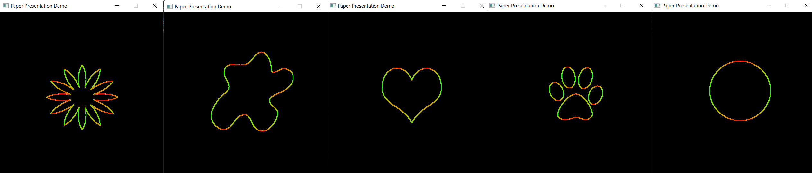

# OpenGL-LUMO
Model OpenGL Based normal approximation based on [LUMO paper](http://ivizlab.sfu.ca/arya/Papers/ACM/NPAR-02/Illumination%20for%20Cel%20Animation.pdf)

* Main scaffolding is based on the shadow mapping tutorial in IN4152
* Gradient technique adapted from [Hebali's sobel operator in GLSL](https://gist.github.com/Hebali/6ebfc66106459aacee6a9fac029d0115)

## Output for test images in resources folder

